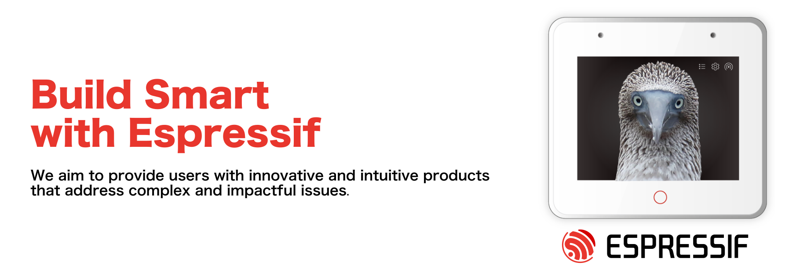

  <picture>
    <source media="(prefers-color-scheme: dark)" srcset="github-banner-black.webp" />
    <source media="(prefers-color-scheme: light)" srcset="github-banner-white.webp" />
    
  </picture>

# Welcome to Espressif on GitHub

All of Espressif’s official software, relating to the various series of ESP32 SoCs, are available on this GitHub organization.
To check out all the series of SoCs from Espressif, please visit our [ESP Product Selector](https://products.espressif.com).

## Get Started

To get started with our solutions, visit our [Developer Portal](https://developer.espressif.com/). The Developer Portal includes articles about solutions, announcements, latest releases, workshops, and events.

You can also check the official [ESP-IDF documentation](https://docs.espressif.com/projects/esp-idf/en/latest/esp32/index.html). In the top left corner, find the drop-down menu and select the appropriate ESP32 series.

If you have questions, ask our [AI chatbot](https://chat.espressif.com/).

## Frameworks

Espressif core development frameworks provide the foundation for building applications on ESP32 and ESP8266, supporting both native and Arduino-based development.

| Framework | Project |
|---|---|
| IoT Development Framework | [ESP-IDF](https://github.com/espressif/esp-idf) |
| Arduino Core for ESP32 | [arduino-esp32](https://github.com/espressif/arduino-esp32) |

## Solutions

Espressif offers a range of ready-to-use firmware and protocol solutions for connectivity, cloud integration, smart devices, and multimedia applications.

| Category | Project |
|---|---|
| AT Commands Firmware | [ESP-AT](https://github.com/espressif/esp-at) |
| Communication Processor Firmware | [ESP-HOSTED](https://github.com/espressif/esp-hosted) |
| Cloud | [ESP-RainMaker](https://github.com/espressif/esp-rainmaker) |
| Smart Devices | [ESP-Matter](https://github.com/espressif/esp-matter) |
| Connectionless Wi-Fi Communication Protocol | [ESP-NOW](https://github.com/espressif/esp-now) |
| HMI | [ESP-Brookesia](https://github.com/espressif/esp-brookesia) |
| General Multimedia Framework | [ESP-GMF](https://github.com/espressif/esp-gmf) |
| Digital Signal Processing | [ESP-DSP](https://github.com/espressif/esp-dsp) |

## AI

Espressif provides AI-focused libraries and frameworks to enable machine learning, signal processing, and intelligent agent capabilities on ESP devices.

| Category | Project |
|---|---|
| AI Agent Framework | [ESP-CLAW](https://github.com/espressif/esp-claw) |
| ESP Private Agents | [ESP-Agents-Firmware](https://github.com/espressif/esp-agents-firmware) |
| High-Performance Deep Learning | [ESP-DL](https://github.com/espressif/esp-dl) |
| Neural Network | [ESP-NN](https://github.com/espressif/esp-nn) |

### MCP Servers

If you are looking for the MCP servers, please visit: [mcp.espressif.com](https://mcp.espressif.com/).

## Libraries and Components

Espressif and the community maintain a rich ecosystem of reusable libraries and components for ESP32 devices. Explore thousands of components — from drivers and protocols to UI libraries and cloud integrations — right on the [ESP Component Registry](https://components.espressif.com/).

## More

To know more about our frameworks, solutions and libraries, see the brief explanation for some of our projects on the [Espressif Projects](esp-projects.md) page.

:office: To learn about the full range of products and services that Espressif offers, please visit our official website [Espressif](https://www.espressif.com).
